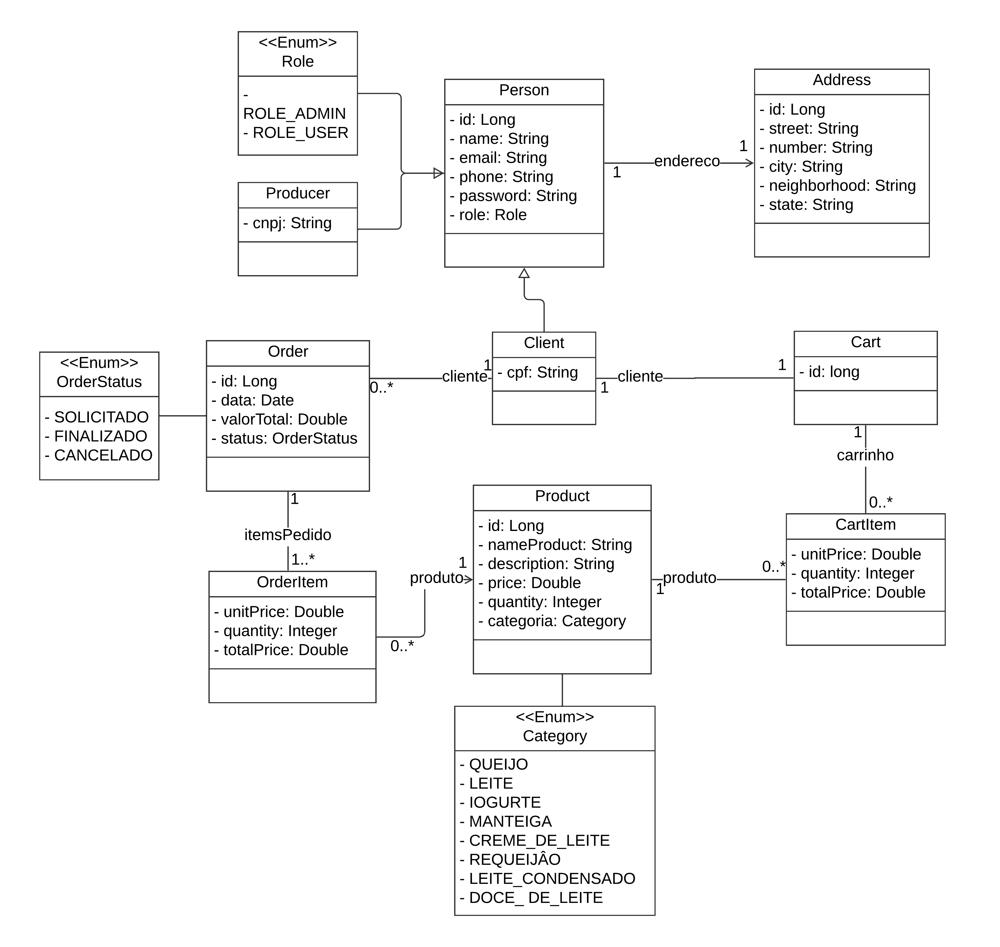

# ecommerce-laticionios
Este projeto é uma plataforma de e-commerce para a venda de laticínios por encomenda, desenvolvida para um vendedor autônomo.

## Diagrama de Classes

# Funcionalidades Implementadas

## Usuário Comum / Cliente
- **Cadastro**: Usuário comum pode se registrar no site.
- **Login**: Cliente que esteja previamente cadastrado no sitema pode realizar o login.
- **Gerenciamento de Dados** - acesso apenas para *Clientes* logados:
  - Visualizar os detalhes de seus dados.
  - Editar seus dados pessoais.
- **Catálogo de Produtos** - acesso para qualquer tipo de *USUÁRIO*:
  - Visualizar o catálogo de produtos disponíveis.
  - Pesquisar produtos por nome.
  - Visualizar produtos mais vendidos
- **Carrinho de Compras** - acesso apenas para *Clientes* logados:
  - Adicionar produtos ao carrinho.
  - Visualizar os itens do carrinho.
  - Remover produtos do carrinho.
  - Finalizar o pedido com os itens do carrinho.
- **Pedidos** - acesso apenas para *Clientes* logados:
  - Visualizar todos pedidos feitos.
  - Cancelar um pedido realizado.

## Administrador / Produtor
- **Gerenciamento de Produtos**:
  - Registrar novos produtos.
  - Listar todos os produtos.
  - Atualizar informações de produtos pelo ID.
  - Remover produtos pelo ID.
  - Buscar produtos específicos pelo ID.
  - Listar produtos com o estoque baixo
- **Gerenciamento de Pedidos**:
  - Listar todos os pedidos.
  - Buscar pedidos específicos pelo ID.
  - Listar pedidos filtrados por status.
  - Atualizar o status de um pedido.
- **Dashboard**:
  - Listar pedidos *FINALIZADO* realizados no mês atual, mostrando informaçôes da quantidade e valor ganho.
  - Listar pedidos *FINALIZADO* totais que foram realizados, mostrando informaçôes da quantidade e valor ganho.
  - Lista quantos pedidos *FINALIZADO* foram realizados em um período e quantos no outro.
  - Listar produtos mais vendidos.
  - Listar produtos menos vendidos.
  - Listar todos a quantidade de pedidos finalizados e cancelados por meses em um perìodo de 11 meses mais o mes atual.

---

# Funcionalidades Planejadas
- ...

---

# Rotas

## Qualquer usuário que não precise estar logado
- **/products**  - um método GET que lista todos os produtos
- **/products/{id}**  - método GET que irá listar o detalhe de um produto
- **/products/search?name=** - método GET que lista produtos de acordo com o nome pesquisado
- **/products/list?category=** - método GET que lista produtos de acordo com a categoria pesquisado
- **/dashboard/products/best-sellers** - método GET que lista os produtos mais vendidos
- **/auth/register** - método POST para o usuário se registrar
- **/auth/login** - método POST para o usuário logar

## Usuário logado(cliente) que fez o login no sistema e possui o token:
- **/my/profile**  - método GET que lista as informações do cliente 
- **/my/details**  - método POST que atualiza as informações do cliente
- **/cart/add**  - método POST onde o cliente adiciona o item ao seu carrinho
- **/cart**  - método GET que exibe o carrinho do cliente com os itens que estão nele
- **/cart/{productId}**  - método DELETE onde o cliente pode remover o item que está no carrinho 
- **/cart/buy**  - método POST que é responsável por fazer a compra dos itens que estão no carrinho
- **/my/orders**  - método GET que lista as informações de pedidos do cliente
- **/my/orders/details/{orderId}**  - método GET que lista as informações de um pedido
- **/my/orders/remove/{orderId}**  - método DELETE que cancela um pedido que esteja com o status de *SOLICITADO*

## Usuário logado (ADM) que fez o login no sistema e possui o token:
- **/products**  - método POST que insere novos produtos
- **/products/{productId}**  - método PUT que atualiza as informações de um produto
- **/products/{productId}**  - método DELETE que deleta algum produto
- **/products/list-categories**  - método GET que lista todas as categorias existentes, `método auxiliar para ajudar o produtor a escolher a categoria certa definida no sitema ao inserir um produto novo`
- **/orders** - método GET que lista todos os pedidos
- **/orders/{orderId}** - método GET que lista os detalhes de um pedido
- **/orders/search?status=** - método GET que lista todos os pedidos de acordo com o status
- **/orders/{orderId}?status=** - método PUT para atualizar o status de um pedido
- **/dashboard/orders/total-revenue/count?startDate=???-??-??&endDate=??-??-??**  - método GET que mostra quantos pedidos *FINALIZADO* foram concluidos em um período e quantos no outro e quanto foi ganho
- **/dashboard/products/low-stock**  - método GET que lista os produtos que estão abaixo do estoque, ele possui um valor default = 10 tendo a opçao de informar o valor pretendido - **/dashboard/products/low-stock?quantity=15**
- **/dashboard/orders/current-month** - método GET que lista a quantidade de pedidos *FINALIZADO* e o valor total ganho no mês atual
- **/dashboard/orders/total-revenue** - método GET que lista a quantidade de pedidos **FINALIZADO** totais que foram feito e o valor total ganho
- **/dashboard/orders/status-summary** - método GET que traz a quantidade de pedidos *FINALIZADO* e *CANCELADO* em um período de 11 meses mais o mês atual, separando os pedidos por meses e *FINALIZDO* e *CANCELADO*
- **/dashboard/orders/comparison?monthOne=????-??-??&monthTwo=????-??-??** - método GET que lista quantos pedidos *FINALIZADO* foram realizados em um período e quantos no outro
- **/dashboard/products/worst-sellers** - método GET que listar os produtos menos pedidos

---

Este documento será atualizado conforme novas funcionalidades forem implementadas.

---
